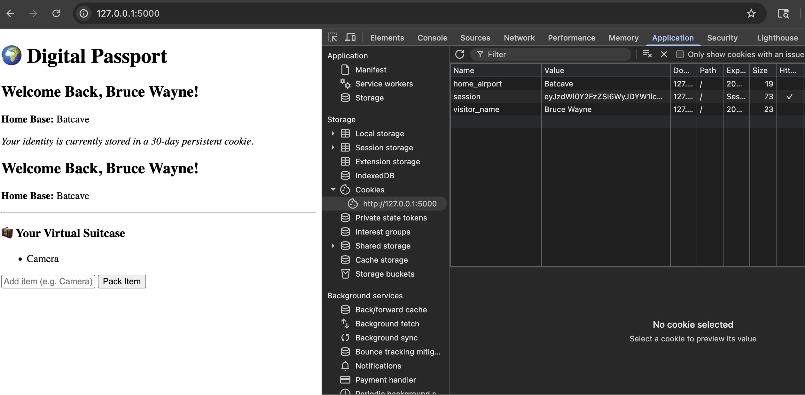
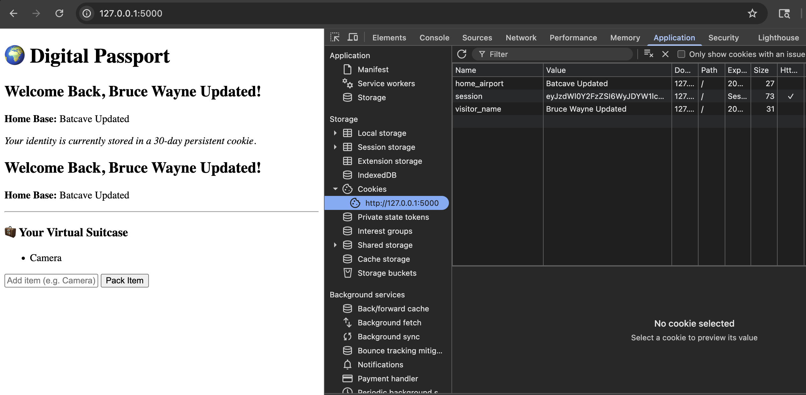

# Learnings

## Plain Cookies
```
response.set_cookie('visitor_name', name, max_age=max_age)
```

- This sets a plain cookie(not the session cookie).
- Stores data directly in the browser, going into developer tools in browser, this value can be modified.







